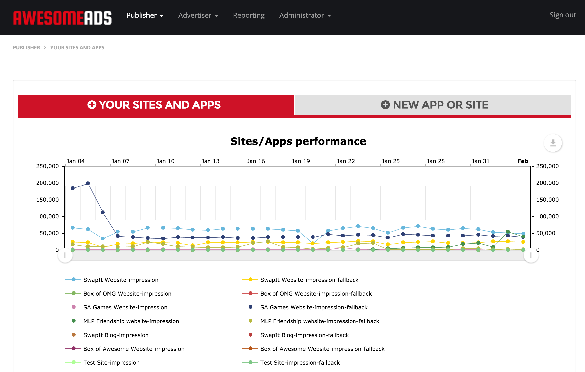
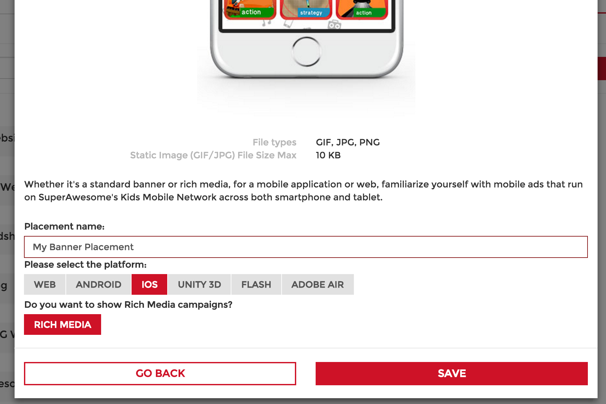
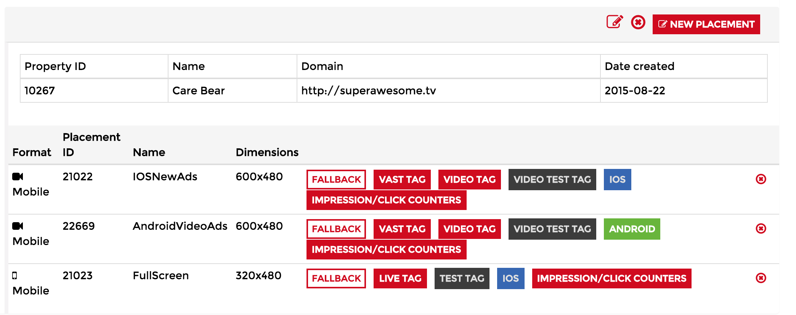

.. This presents the dashboard, apps and placements

Getting started
===============

The first step in integrating the SuperAwesome SDK is to register on the `SuperAwesome Dashboard <http://dashboard.superawesome.tv>`_.

From here you'll be able to create apps and placements and obtain reports about their performance over time (number of impressions, of clicks, etc).

Apps
^^^^

When first logging in to the dashboard, the first thing you'll want to do is create one or more **Apps**,
with each app in the dashboard representing one of your own apps.

Every app has a number of associated parameters like ID, name, domain (or iTunes URL), etc.
The name and domain can be configured when creating the app, while the ID is auto-generated and is unique to each app.

.. image:: img/IMG_01_Dashboard_2.png

In turn, each app can have multiple placements.

Placements
^^^^^^^^^^

Placements represent ad units where creatives will be served. Creatives are the actual ad data that gets shown in your app,
like images, videos, interactive rich media content, etc.

Each placement has a number of associated parameters like ID, name, format, dimension.
    * The placement's ID is a unique identifier associated with the placement. In the SDK it will be used to load ad data.
    * The name is a human readable identifier. It's good practice to name your placements something easy to remember or suggestive.
    * The format can be video, display, etc, and informs you of what type of ads should be run on the placement.
    * The dimensions give you an idea of where you should try to place the ad in your app.

When creating placements in the dashboard, you have the following options for Mobile:

==================  ==========  ========    ===========
Name                Size        Format      Description
==================  ==========  ========    ===========
Standard Mobile     320x50px    image       Standard mobile banner. Displays images and rich media. Won't display video.
SM Mobile           300x50px    image       Smaller mobile banner; Displays images and rich media. Won't display video.
Interstitial        320x480px   image       Portrait mobile interstitial (fullscreen) ad. Displays images and rich media. Won't display video.
Interstitial LS     480x320px   image       Landscape mobile interstitial (fullscreen) ad. Displays images and rich media. Won't display video.
Leaderboard         728x90px    image       Larger banner-type ad, for tablets. Displays images and rich media. Won't display video.
MPU                 300x250px   image       Special 300x250 banner. Used to break page content. Displays images and rich media. Won't display video.
LG Interstitial     768x1024px  image       Large portrait tablet interstitial (fullscreen) ad. Displays images and rich media. Won't display video.
LG Interstitial LS  1024x768px  image       Large landscape tablet interstitial (fullscreen) ad. Displays images and rich media. Won't display video.
Video Preroll       Flexible    video       Fullscreen video ad.
Gamewall            Flexible    gamewall    Fullscreen game wall.
==================  ==========  ========    ===========

Test placements
^^^^^^^^^^^^^^^

We also provide some demo placements that can be used for testing. These placements have a 100% fill rate.

============  ===========
Placement Id  Description
============  ===========
5687          320x50 banner
5692          320x480 interstitial
5740          video
============  ===========
